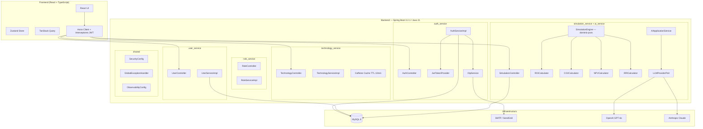

# Visión General de Arquitectura — RenewSim

## Descripción del Sistema

RenewSim es una plataforma enterprise de simulación de energías renovables construida sobre Arquitectura Hexagonal (Puertos y Adaptadores) con DDD Táctico. El backend es Java 21 / Spring Boot 3.2.1 organizado en 5 bounded contexts independientes. El frontend es React 18 + TypeScript con Vite, Zustand y TanStack Query.

---

## Diagrama de Arquitectura Hexagonal



---

## Principios Arquitectónicos No Negociables

| Capa | Regla | Consecuencia de Violación |
|------|-------|--------------------------|
| Domain | Sin anotaciones Spring, sin JPA, sin dependencias de infraestructura | Tests de dominio fallan al requerir contexto Spring |
| Application | Orquesta casos de uso, no implementa detalles técnicos | Lógica de negocio dispersa, difícil de testear |
| Infrastructure | Implementa puertos, no contiene lógica de negocio | Acoplamiento entre dominio e infraestructura |
| Web | Solo traduce HTTP ↔ Application, no contiene lógica | Lógica duplicada en controllers |

---

## Stack Tecnológico

| Capa | Tecnología | Versión |
|------|-----------|---------|
| Backend runtime | Java (Virtual Threads habilitados) | 21 |
| Framework | Spring Boot | 3.2.1 |
| Seguridad | Spring Security + JJWT | 6 / 0.11.5 |
| Persistencia | Spring Data JPA + Hibernate + MySQL | 6 / 8 |
| Caché | Caffeine | 3.1.8 |
| Mapeo | MapStruct | 1.6.2 |
| Resiliencia | Resilience4j | 2.x |
| Documentación | SpringDoc OpenAPI | 2.5.0 |
| Frontend | React + TypeScript + Vite | 18 / 5 / 5 |
| Estado cliente | Zustand | 4.x |
| Estado servidor | TanStack Query | 5.x |
| Formularios | React Hook Form + Zod | 7.x / 3.x |
| UI | Tailwind CSS + shadcn/ui | 3.x |
| Gráficos | Recharts | 2.x |
| Mapas | Leaflet + react-leaflet | 1.9 / 4.x |
| HTTP | Axios | 1.x |
| Testing backend | JUnit 5 + Mockito + Testcontainers + jqwik | — |
| Testing frontend | Vitest + Testing Library + fast-check | — |

---

## Estructura de Capas por Bounded Context

```
com.renewsim.backend.{context}/
├── domain/
│   ├── model/          ← Aggregates, Entities, Value Objects
│   ├── service/        ← Domain Services (sin Spring)
│   ├── repository/     ← Puertos de salida (interfaces)
│   ├── exception/      ← Excepciones de dominio
│   └── policy/         ← Reglas de negocio complejas
├── application/
│   ├── port/
│   │   ├── in/         ← Casos de uso (interfaces)
│   │   └── out/        ← Puertos de salida adicionales
│   ├── command/        ← Objetos de comando (inmutables)
│   ├── service/        ← Implementaciones de casos de uso
│   └── mapper/         ← MapStruct mappers
├── infrastructure/
│   ├── persistence/    ← Adaptadores JPA, repositorios
│   ├── config/         ← Configuración Spring
│   ├── security/       ← Filtros, providers JWT
│   └── client/         ← Clientes HTTP externos (LLM, SMTP)
└── web/
    ├── controller/     ← REST Controllers
    └── dto/            ← Request/Response DTOs
```

---

## ADR-001: Arquitectura Hexagonal vs Layered Architecture

**Decisión:** Arquitectura Hexagonal (Puertos y Adaptadores)

**Contexto:** El sistema tiene múltiples bounded contexts con lógica de dominio compleja (motor de simulación, cálculos financieros) y múltiples adaptadores de infraestructura (MySQL, LLM providers, SMTP).

**Consecuencias positivas:**
- La capa de dominio es testeable sin Spring ni base de datos
- Los adaptadores son intercambiables (ej: cambiar de OpenAI a Anthropic sin tocar el dominio)
- Cumple el requisito 21.2: "La capa de dominio NO DEBERÁ contener anotaciones Spring"

**Consecuencias negativas:**
- Mayor cantidad de interfaces y clases que una arquitectura en capas simple
- Curva de aprendizaje para desarrolladores nuevos al proyecto

---

## ADR-002: MySQL vs PostgreSQL

**Decisión:** MySQL 8 como base de datos principal

**Contexto:** El proyecto ya tiene `mysql-connector-j` en el pom.xml y scripts DDL escritos para MySQL 8 (sintaxis `ENGINE=InnoDB`, `ENUM`, `AUTO_INCREMENT`).

**Consecuencias positivas:**
- Consistencia con el código existente y los scripts de migración Flyway
- Amplio soporte en hosting compartido y cloud (RDS, PlanetScale)
- Soporte nativo para columnas JSON (usado en `scenarios.climate_profile`)

**Consecuencias negativas:**
- PostgreSQL tiene mejor soporte para tipos avanzados y extensiones (PostGIS para geolocalización)
- Se mantiene el driver de PostgreSQL como dependencia opcional para posible migración futura

---

## ADR-003: JWT Stateless vs OAuth2/OIDC

**Decisión:** JWT firmado con HS512 + blacklist JTI + refresh token en cookie HttpOnly

**Contexto:** El sistema requiere escalado horizontal sin afinidad de sesión (requisito 20.1). OAuth2/OIDC añadiría complejidad operacional (servidor de autorización separado).

**Consecuencias positivas:**
- Stateless: cualquier instancia del backend puede validar tokens
- Blacklist JTI permite revocación inmediata en logout
- Refresh token en cookie HttpOnly previene robo via XSS

**Consecuencias negativas:**
- La blacklist requiere consulta a BD en cada request (mitigado con caché Caffeine)
- No hay SSO nativo (roadmap futuro: OAuth2/OIDC en Fase 5)

---

## ADR-004: React + TypeScript + Vite vs Next.js

**Decisión:** React 18 + TypeScript + Vite (SPA pura)

**Contexto:** La plataforma es una aplicación de dashboard interactivo con estado complejo. No requiere SSR para SEO (es una aplicación autenticada detrás de login).

**Consecuencias positivas:**
- Vite ofrece HMR instantáneo y builds más rápidos que Next.js
- SPA simplifica el manejo de estado global (Zustand) y autenticación
- Menor complejidad de despliegue (solo archivos estáticos en Nginx)

**Consecuencias negativas:**
- Sin SSR: el LCP inicial puede ser mayor (mitigado con code splitting y lazy loading)
- Sin generación estática para páginas públicas (landing page requeriría solución separada)

---

## ADR-005: Email OTP vs TOTP (Google Authenticator) para 2FA

**Decisión:** Email OTP como método principal de 2FA

**Contexto:** El sistema sirve a usuarios no técnicos (hogares, pequeñas empresas) que pueden no tener apps de autenticación instaladas.

**Consecuencias positivas:**
- Cero fricción de onboarding: no requiere instalar apps adicionales
- El email ya es un canal verificado (usado también para activación de cuenta)
- Roadmap claro: TOTP como alternativa en Fase 2

**Consecuencias negativas:**
- Dependencia del servicio de email (mitigado con retry + fallback SMTP)
- Menor seguridad que TOTP si el email del usuario es comprometido

---

## ADR-006: Caffeine vs Redis para Caché

**Decisión:** Caffeine como caché en memoria local

**Contexto:** El sistema usa caché principalmente para el catálogo de tecnologías (TTL 10 min) y contadores de rate limiting. No hay requisito de caché distribuida en la fase actual.

**Consecuencias positivas:**
- Sin dependencia de infraestructura adicional (Redis requiere servidor separado)
- Latencia de acceso sub-milisegundo (caché en proceso JVM)
- Configuración simple con Spring Cache + `@Cacheable`

**Consecuencias negativas:**
- Caché no compartida entre instancias en escalado horizontal
- Los contadores de rate limiting por usuario serán inconsistentes entre nodos con múltiples instancias
- Migración a Redis requerida si se implementa escalado horizontal real (> 2 instancias)
