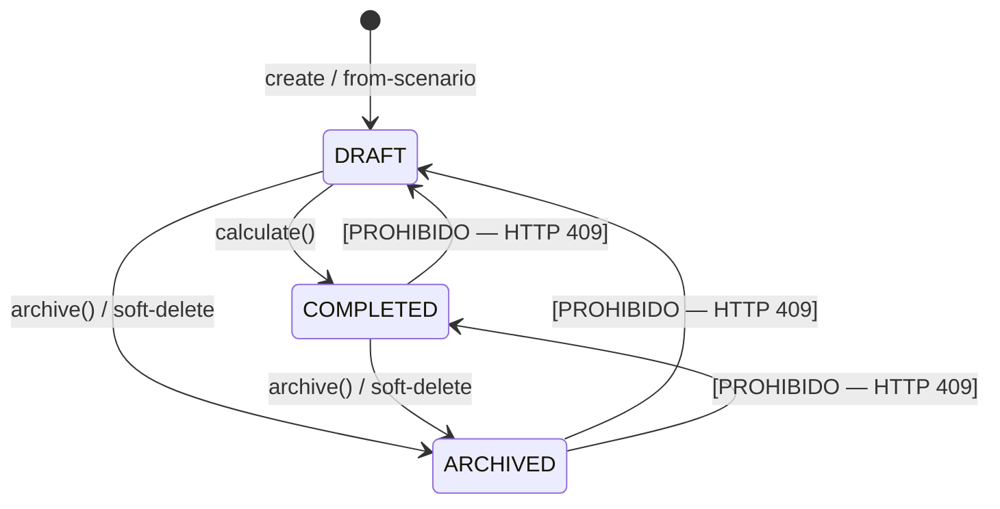
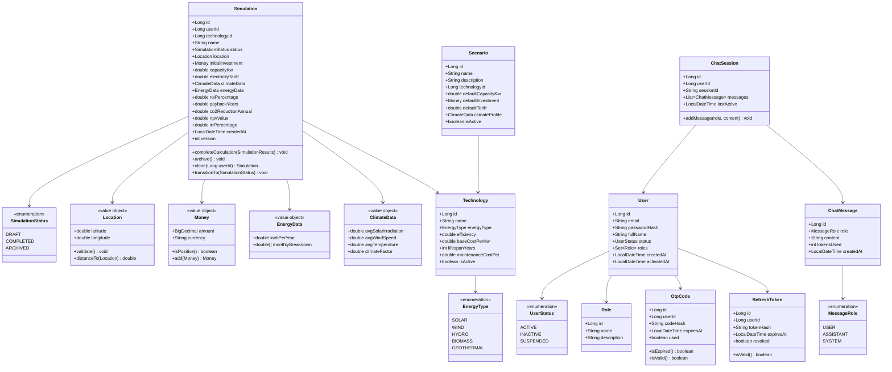

# Modelo de Dominio — RenewSim

## Aggregate Root: Simulation

La `Simulation` es el aggregate root del bounded context `simulation_service`. Encapsula todos los parámetros de entrada, resultados calculados y el estado del ciclo de vida.

### Invariantes del Aggregate

- `capacityKw` debe estar en el rango [1, 10.000]
- `initialInvestment` debe ser > 0
- `latitude` debe estar en [-90, 90], `longitude` en [-180, 180]
- Las transiciones de estado solo siguen: `DRAFT → COMPLETED → ARCHIVED`
- Los resultados calculados solo son válidos cuando `status = COMPLETED`

### Máquina de Estados



---

## Diagrama de Clases del Dominio



---

## Value Objects

### Location

```java
public record Location(double latitude, double longitude) {
    public Location {
        if (latitude < -90 || latitude > 90)
            throw new InvalidLocationException("Latitude must be between -90 and 90");
        if (longitude < -180 || longitude > 180)
            throw new InvalidLocationException("Longitude must be between -180 and 180");
    }
}
```

### Money

```java
public record Money(BigDecimal amount, String currency) {
    public Money {
        Objects.requireNonNull(amount);
        Objects.requireNonNull(currency);
        if (amount.compareTo(BigDecimal.ZERO) < 0)
            throw new InvalidMoneyException("Amount cannot be negative");
    }
    public boolean isPositive() { return amount.compareTo(BigDecimal.ZERO) > 0; }
}
```

### ClimateData

```java
public record ClimateData(
    double avgSolarIrradiation,  // kWh/m²/día
    double avgWindSpeed,          // m/s
    double avgTemperature         // °C
) {}
```

---

## Puertos del Dominio

```java
// Puerto de salida — Repositorio de simulaciones
public interface SimulationRepository {
    Simulation save(Simulation simulation);
    Optional<Simulation> findById(Long id);
    List<Simulation> findByUserIdAndStatusNot(Long userId, SimulationStatus status, Pageable pageable);
    void delete(Long id);
}

// Puerto de entrada — Caso de uso de simulación
public interface CreateSimulationUseCase {
    SimulationCreationResultDTO execute(CreateSimulationCommand command);
}

// Puerto de salida — Proveedor LLM
public interface LLMProviderPort {
    AIResponse complete(AIRequest request);
}

// Puerto de salida — Servicio de email
public interface EmailPort {
    void sendOtpEmail(String to, String otpCode);
    void sendActivationEmail(String to, String activationToken);
}
```
