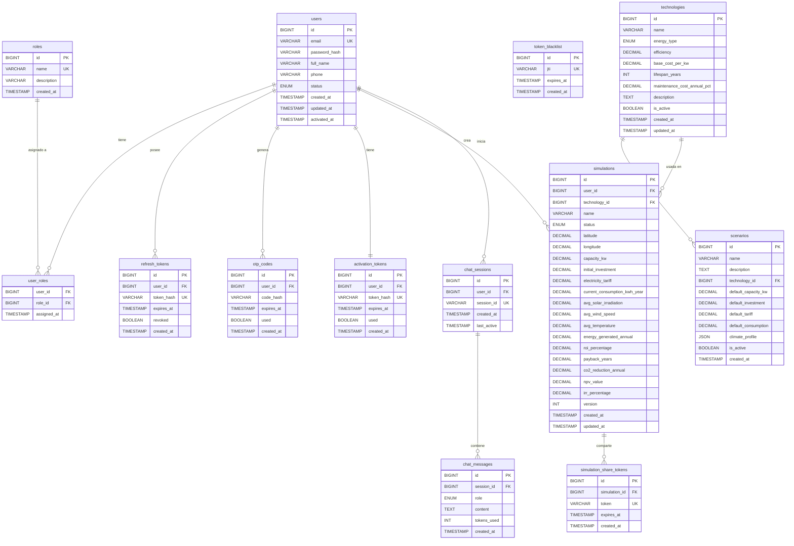

# Diseño de Base de Datos — RenewSim

## ERD Completo



---

## Estrategia de Índices

| Tabla | Índice | Columnas | Tipo | Query que Optimiza |
|-------|--------|----------|------|-------------------|
| users | idx_users_email | email | UNIQUE | Login paso 1: `WHERE email = ?` |
| users | idx_users_status | status | SIMPLE | Admin: listar usuarios `WHERE status = 'ACTIVE'` |
| user_roles | pk_user_roles | (user_id, role_id) | COMPOSITE PK | Join users-roles, verificación de permisos |
| refresh_tokens | idx_refresh_token_hash | token_hash | UNIQUE | Auth refresh: `WHERE token_hash = ?` |
| refresh_tokens | idx_refresh_token_user | user_id | SIMPLE | Invalidar todos los tokens de un usuario |
| refresh_tokens | idx_refresh_token_expires | expires_at | SIMPLE | Cleanup job: `DELETE WHERE expires_at < NOW()` |
| otp_codes | idx_otp_user_expires | (user_id, expires_at) | COMPOSITE | Login paso 2: `WHERE user_id = ? AND expires_at > NOW() AND used = FALSE` |
| token_blacklist | idx_blacklist_jti | jti | UNIQUE | JWT validation: `SELECT EXISTS(... WHERE jti = ?)` |
| token_blacklist | idx_blacklist_expires | expires_at | SIMPLE | Cleanup job: `DELETE WHERE expires_at < NOW()` |
| activation_tokens | idx_activation_token_hash | token_hash | UNIQUE | Activación: `WHERE token_hash = ?` |
| technologies | idx_technologies_energy_type | energy_type | SIMPLE | Filtrar por tipo: `WHERE energy_type = 'SOLAR'` |
| technologies | idx_technologies_active | is_active | SIMPLE | Listar activas: `WHERE is_active = TRUE` |
| simulations | idx_simulations_user_status | (user_id, status) | COMPOSITE | My simulations: `WHERE user_id = ? AND status != 'ARCHIVED'` |
| simulations | idx_simulations_technology | technology_id | SIMPLE | Join con technologies para listar |
| simulations | idx_simulations_created_at | created_at | SIMPLE | Dashboard recientes: `ORDER BY created_at DESC LIMIT 5` |
| simulation_share_tokens | idx_share_token | token | UNIQUE | Vista pública: `WHERE token = ?` |
| simulation_share_tokens | idx_share_expires | expires_at | SIMPLE | Cleanup job: `DELETE WHERE expires_at < NOW()` |
| chat_sessions | idx_chat_session_id | session_id | UNIQUE | AI chat: `WHERE session_id = ?` |
| chat_sessions | idx_chat_user | user_id | SIMPLE | Listar sesiones del usuario |
| chat_messages | idx_chat_messages_session | session_id | SIMPLE | Historial: `WHERE session_id = ? ORDER BY created_at` |

### Justificación de Índices Compuestos

**`idx_otp_user_expires` (user_id, expires_at):**
La query más frecuente en el flujo de login paso 2 es:
```sql
SELECT * FROM otp_codes
WHERE user_id = ? AND expires_at > NOW() AND used = FALSE
ORDER BY created_at DESC LIMIT 1;
```
El índice compuesto permite filtrar primero por `user_id` (alta selectividad) y luego por `expires_at` sin full scan.

**`idx_simulations_user_status` (user_id, status):**
La query de "mis simulaciones" es la más frecuente del sistema:
```sql
SELECT * FROM simulations
WHERE user_id = ? AND status != 'ARCHIVED'
ORDER BY created_at DESC;
```
El índice compuesto cubre ambas condiciones del WHERE en un solo acceso al índice.

---

## Secuencia de Migraciones Flyway

| Versión | Archivo | Contenido | Dependencias |
|---------|---------|-----------|--------------|
| V1 | V1__create_users_and_roles.sql | Tablas: `users`, `roles`, `user_roles` | — |
| V2 | V2__create_auth_tables.sql | Tablas: `refresh_tokens`, `token_blacklist`, `otp_codes`, `activation_tokens` | V1 (FK a users) |
| V3 | V3__create_technologies_and_scenarios.sql | Tablas: `technologies`, `scenarios` | — |
| V4 | V4__create_simulations.sql | Tablas: `simulations`, `simulation_share_tokens` | V1 (FK a users), V3 (FK a technologies) |
| V5 | V5__seed_roles.sql | INSERT roles: USER, ADMIN, ANALYST | V1 |
| V6 | V6__create_ai_tables.sql | Tablas: `chat_sessions`, `chat_messages` | V1 (FK a users) |
| V7 | V7__seed_technologies.sql | INSERT 3 tecnologías iniciales (Solar, Eólica, Hidro) | V3 |
| V8 | V8__seed_scenarios.sql | INSERT 3 escenarios predefinidos | V3, V7 |

> Nota: Los seeds de datos (V7, V8) van después de crear todas las tablas y el seed de roles (V5, V6) para garantizar que las FKs existen. Este orden difiere del Anexo D del documento de requerimientos (que numeraba los seeds como V4 y V5 antes de crear las tablas de IA). La secuencia aquí es la correcta para producción.

### Política de Migraciones

- **Nunca modificar** una migración ya aplicada en producción
- **Nunca eliminar** migraciones del repositorio
- Para revertir: crear nueva migración `V{X+1}__revert_{descripción}.sql`
- Flyway almacena checksum de cada migración en `flyway_schema_history`
- En CI: `./mvnw flyway:validate` verifica que no haya migraciones modificadas

---

## Análisis de Normalización (3NF)

### Verificación de Formas Normales

Todas las tablas del sistema cumplen la Tercera Forma Normal (3NF):

**1NF — Valores atómicos:**
- ✅ Todos los atributos contienen valores atómicos
- ✅ No hay columnas multi-valuadas (los roles se modelan en tabla separada `user_roles`)
- ✅ No hay grupos repetitivos
- Excepción intencional: `scenarios.climate_profile` es JSON — denormalización justificada (ver abajo)

**2NF — Sin dependencias parciales:**
- ✅ Todas las tablas tienen PK simple (BIGINT AUTO_INCREMENT) excepto `user_roles`
- ✅ En `user_roles`: `assigned_at` depende completamente de la PK compuesta `(user_id, role_id)`
- ✅ No hay atributos que dependan solo de parte de la PK

**3NF — Sin dependencias transitivas:**
- ✅ En `simulations`: `energy_generated_annual` NO depende de `capacity_kw` directamente — ambos dependen de `id` (el resultado calculado se almacena, no se deriva en tiempo de consulta)
- ✅ En `simulations`: `technology_id` es FK, no se almacena `technology_name` (evita dependencia transitiva)
- ✅ En `user_roles`: no hay atributos adicionales que creen dependencias transitivas

### Denormalizaciones Intencionales

| Tabla | Campo | Tipo | Justificación |
|-------|-------|------|---------------|
| scenarios | climate_profile | JSON | Perfil climático es un conjunto de parámetros variables por escenario. Modelarlo en tabla separada requeriría JOIN complejo sin beneficio real dado el bajo volumen de escenarios. |
| simulations | energy_generated_annual, roi_percentage, etc. | DECIMAL | Los resultados calculados se persisten para evitar recálculo en cada consulta. Esto es una denormalización de datos derivados, justificada por el coste computacional del motor de simulación. |

### Candidatos Futuros a Denormalización

Si se detectan problemas de rendimiento en producción (> 1M simulaciones):

1. Añadir `technology_name` en `simulations` — evita JOIN para listar simulaciones
2. Añadir columna `monthly_breakdown_json` en `simulations` — almacena desglose mensual calculado
3. Tabla de proyecciones `simulation_projections` — almacena resultados de análisis predictivo IA
