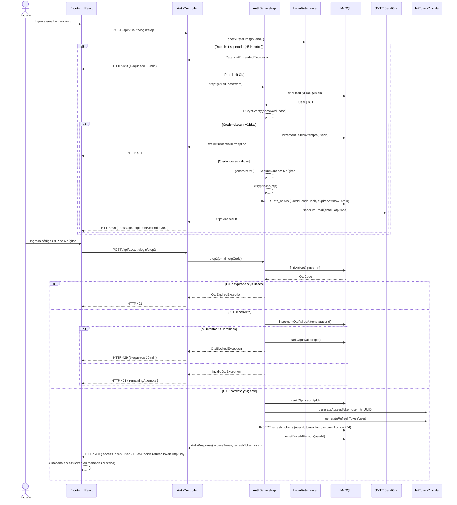
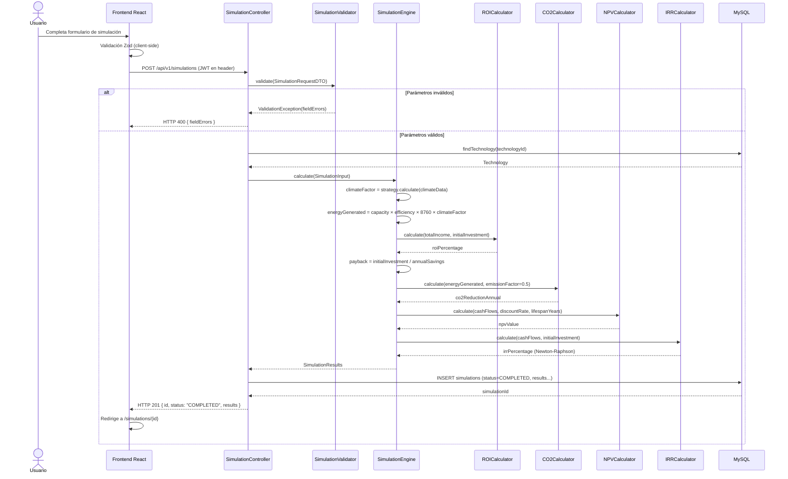
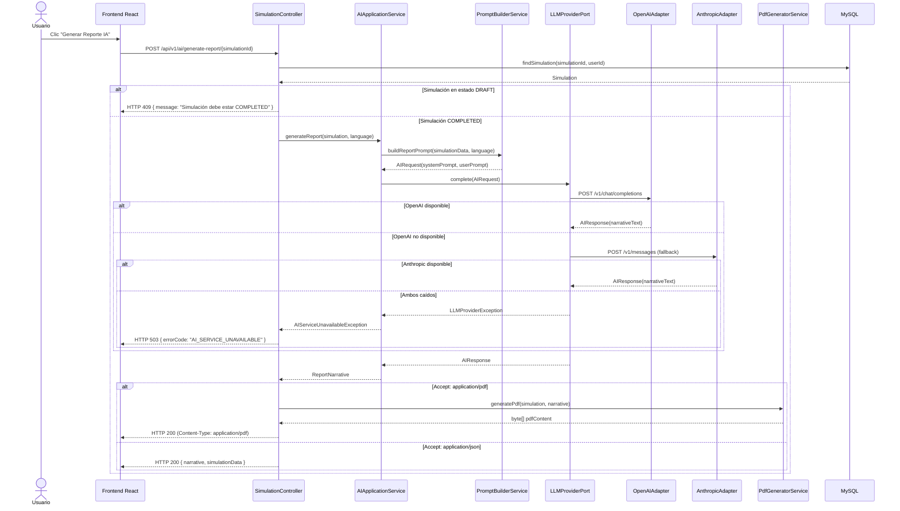
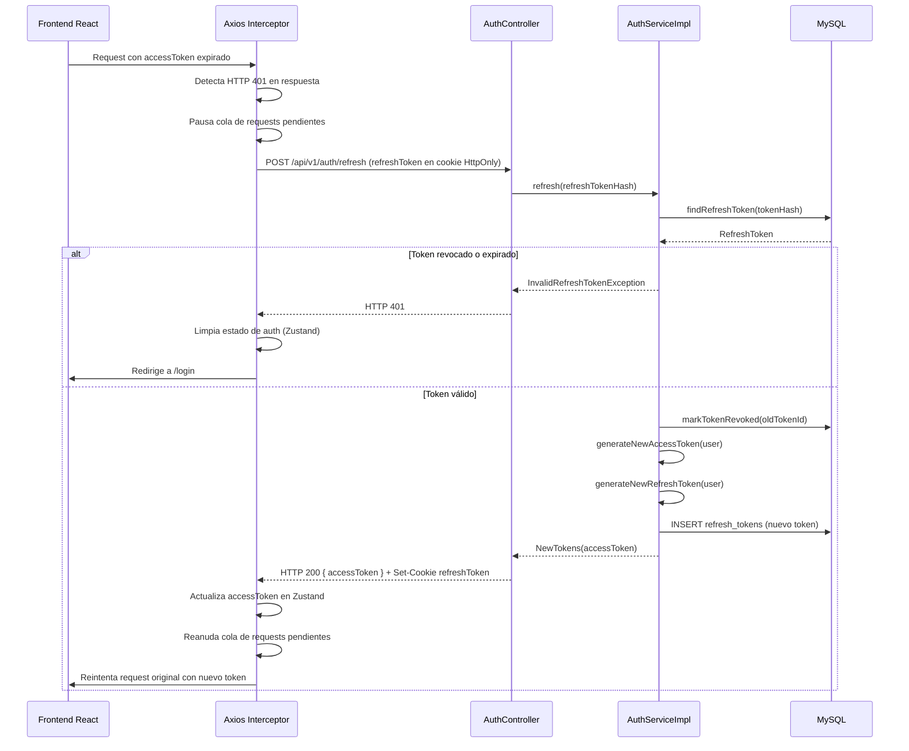
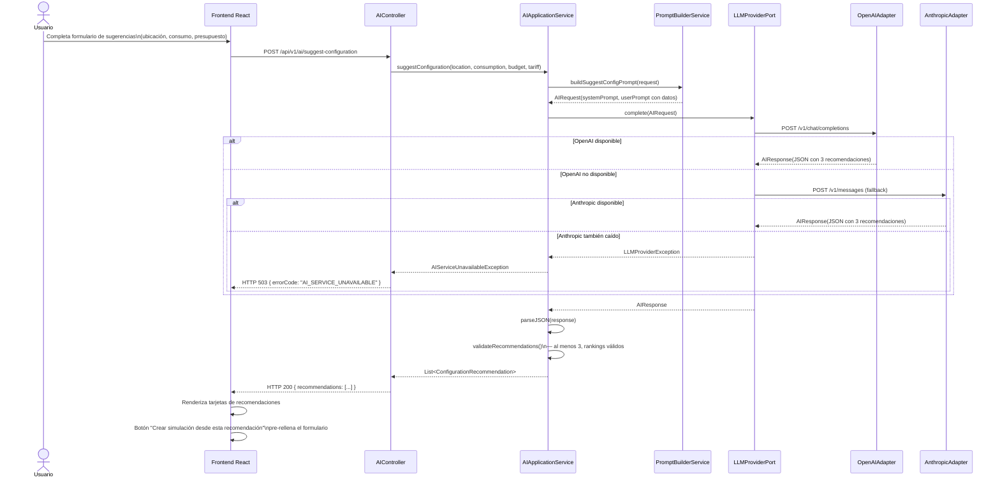

# Diagramas de Secuencia — RenewSim

## 1. Flujo Completo de Login 2FA

---

## 2. Crear Simulación Personalizada

---

## 3. Generar Reporte con IA

---

## 4. Refresh Token Automático desde el Frontend

---

## 5. Sugerencias de Configuración con IA

