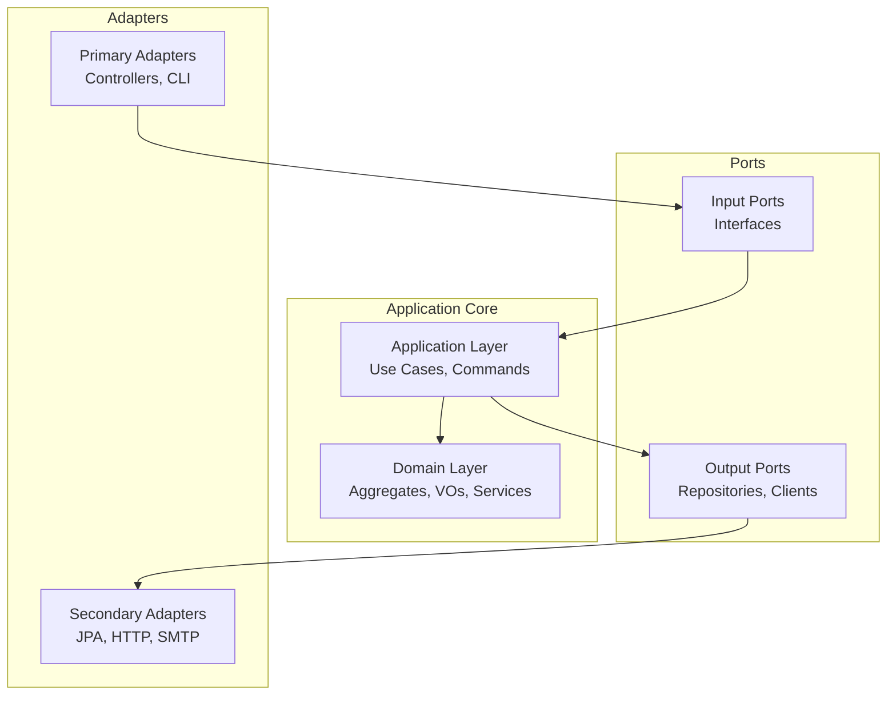
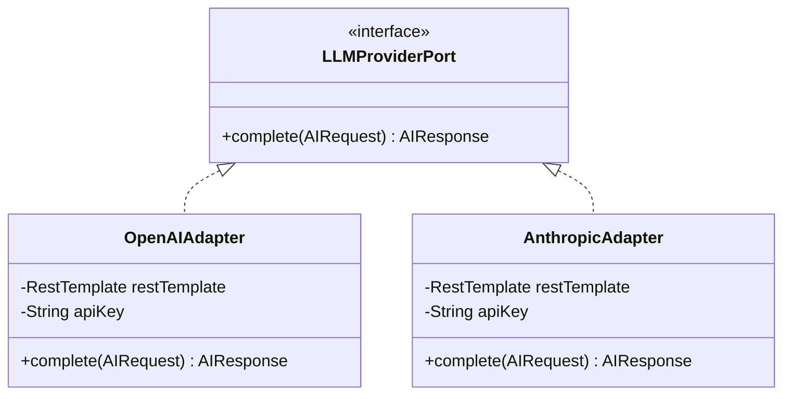

# Patrones de Diseño Aplicados — RenewSim

## Introducción

Este documento cataloga los 13 patrones de diseño utilizados en RenewSim. Cada patrón incluye: categoría, problema que resuelve, dónde se aplica, diagrama y código de ejemplo.

---

## Patrones de Arquitectura

### 1. Hexagonal Architecture (Ports & Adapters)

**Categoría:** Arquitectura

**Problema que resuelve:**
- Acoplamiento de lógica de negocio con frameworks e infraestructura
- Dificultad para testear dominio sin dependencias externas
- Intercambiabilidad de adaptadores (cambiar BD, cambiar proveedor LLM)

**Dónde se aplica en RenewSim:**
- Todos los bounded contexts siguen estructura hexagonal
- `domain/` contiene lógica de negocio pura (sin Spring)
- `infrastructure/` contiene adaptadores (JPA, HTTP clients, SMTP)
- `application/` orquesta casos de uso usando puertos

**Diagrama:**


**Código de ejemplo:**
```java
// Puerto de salida (interfaz en domain/repository)
public interface SimulationRepository {
    Simulation save(Simulation simulation);
    Optional<Simulation> findById(Long id);
}

// Adaptador (implementación en infrastructure/persistence)
@Repository
class SimulationJpaRepository implements SimulationRepository {
    @PersistenceContext
    private EntityManager em;

    @Override
    public Simulation save(Simulation simulation) {
        SimulationEntity entity = SimulationMapper.toEntity(simulation);
        em.persist(entity);
        return SimulationMapper.toDomain(entity);
    }
}
```

---

### 2. CQRS (Command Query Responsibility Segregation)

**Categoría:** Arquitectura

**Problema que resuelve:**
- Mezcla de operaciones de lectura y escritura en el mismo modelo
- Dificultad para optimizar cada tipo de operación independientemente

**Dónde se aplica en RenewSim:**
- Application layer separa Commands (write) de Queries (read)
- `CreateSimulationCommand`, `UpdateSimulationCommand` → operaciones de escritura
- `GetSimulationQuery`, `ListSimulationsQuery` → operaciones de lectura

**Código de ejemplo:**
```java
// Command (write operation) — inmutable
public record CreateSimulationCommand(
    String name,
    Long technologyId,
    Location location,
    double capacityKw,
    Money initialInvestment,
    Long userId
) {}

// Query (read operation) — inmutable
public record GetSimulationQuery(Long simulationId, Long userId) {}

// Application Service separa ambos paths
@Service
public class SimulationApplicationService {

    public SimulationDTO create(CreateSimulationCommand cmd) {
        // Write path: valida, calcula, persiste
    }

    public SimulationDTO get(GetSimulationQuery query) {
        // Read path: puede usar proyecciones optimizadas
    }
}
```

---

## Patrones Creacionales

### 3. Builder Pattern

**Categoría:** Creacional

**Problema que resuelve:**
- Aggregates con muchos parámetros opcionales
- Necesidad de validar invariantes antes de crear el objeto
- Inmutabilidad de objetos de dominio

**Dónde se aplica en RenewSim:**
- `Simulation.builder()` — construcción del aggregate root con validación de invariantes
- `SimulationInput.builder()` — construcción de value object de entrada al motor

**Código de ejemplo:**
```java
public class Simulation {
    private final Long id;
    private final Long userId;
    private final String name;
    private final Location location;
    private final double capacityKw;

    private Simulation(Builder builder) {
        this.id = builder.id;
        this.userId = builder.userId;
        this.name = builder.name;
        this.location = builder.location;
        this.capacityKw = builder.capacityKw;
        validate(); // Valida invariantes en construcción
    }

    private void validate() {
        if (capacityKw < 1 || capacityKw > 10_000) {
            throw new InvalidSimulationException(
                "Capacity must be between 1 and 10,000 kW"
            );
        }
    }

    public static Builder builder() { return new Builder(); }

    public static class Builder {
        private Long id;
        private Long userId;
        private String name;
        private Location location;
        private double capacityKw;

        public Builder id(Long id) { this.id = id; return this; }
        public Builder userId(Long userId) { this.userId = userId; return this; }
        public Builder name(String name) { this.name = name; return this; }
        public Builder location(Location location) { this.location = location; return this; }
        public Builder capacityKw(double kw) { this.capacityKw = kw; return this; }
        public Simulation build() { return new Simulation(this); }
    }
}
```

---

### 4. Factory Pattern

**Categoría:** Creacional

**Problema que resuelve:**
- Lógica compleja de creación de objetos según tipo
- Encapsular decisiones de qué clase concreta instanciar

**Dónde se aplica en RenewSim:**
- `SimulationFactory` — crea simulaciones desde escenarios predefinidos
- `LLMProviderFactory` — selecciona proveedor LLM según configuración activa

**Código de ejemplo:**
```java
@Component
public class SimulationFactory {

    public Simulation createFromScenario(Scenario scenario, Long userId) {
        return Simulation.builder()
            .userId(userId)
            .name(scenario.getName())
            .technologyId(scenario.getTechnologyId())
            .capacityKw(scenario.getDefaultCapacityKw())
            .initialInvestment(scenario.getDefaultInvestment())
            .location(extractLocationFromClimateProfile(scenario))
            .status(SimulationStatus.DRAFT)
            .build();
    }

    private Location extractLocationFromClimateProfile(Scenario scenario) {
        // Extrae coordenadas del JSON climate_profile
        return new Location(
            scenario.getClimateProfile().getLatitude(),
            scenario.getClimateProfile().getLongitude()
        );
    }
}
```

---

## Patrones Estructurales

### 5. Adapter Pattern

**Categoría:** Estructural

**Problema que resuelve:**
- Incompatibilidad de interfaces entre sistemas externos
- Dependencia de implementaciones concretas de servicios externos (LLM providers)

**Dónde se aplica en RenewSim:**
- `OpenAIAdapter` y `AnthropicAdapter` implementan `LLMProviderPort`
- Adaptadores JPA implementan repositorios de dominio

**Diagrama:**


**Código de ejemplo:**
```java
// Puerto (interfaz de dominio — sin dependencias externas)
public interface LLMProviderPort {
    AIResponse complete(AIRequest request);
}

// Adaptador OpenAI
@Component("openai")
public class OpenAIAdapter implements LLMProviderPort {

    @Value("${ai.openai.api-key}")
    private String apiKey;

    @Override
    public AIResponse complete(AIRequest request) {
        // Mapea AIRequest → formato OpenAI ChatCompletion
        OpenAIChatRequest openAIRequest = mapToOpenAI(request);
        // Llama a API REST de OpenAI
        OpenAIChatResponse response = callOpenAI(openAIRequest);
        // Mapea respuesta OpenAI → AIResponse
        return mapFromOpenAI(response);
    }
}

// Adaptador Anthropic (fallback)
@Component("anthropic")
public class AnthropicAdapter implements LLMProviderPort {
    @Override
    public AIResponse complete(AIRequest request) {
        // Mapea AIRequest → formato Anthropic Messages API
        // ...
    }
}
```

---

### 6. Facade Pattern

**Categoría:** Estructural

**Problema que resuelve:**
- Complejidad de orquestar múltiples servicios de dominio
- Necesidad de una interfaz simplificada para clientes externos (controllers)

**Dónde se aplica en RenewSim:**
- `SimulationApplicationService` — fachada que orquesta `SimulationEngine`, `ROICalculator`, `NPVCalculator`, repositorios
- `AIApplicationService` — fachada para `PromptBuilderService`, `LLMProviderPort`, `ResponseParserService`

**Código de ejemplo:**
```java
@Service
public class SimulationApplicationService {

    private final SimulationEngine engine;
    private final SimulationRepository repository;
    private final TechnologyRepository techRepo;
    private final SimulationFactory factory;

    // El controller solo llama a este método — no conoce los detalles internos
    public SimulationDTO create(CreateSimulationCommand cmd) {
        Technology tech = techRepo.findById(cmd.technologyId())
            .orElseThrow(() -> new ResourceNotFoundException("Technology not found"));

        Simulation simulation = Simulation.builder()
            .name(cmd.name())
            .userId(cmd.userId())
            .technologyId(cmd.technologyId())
            .location(cmd.location())
            .capacityKw(cmd.capacityKw())
            .initialInvestment(cmd.initialInvestment())
            .status(SimulationStatus.DRAFT)
            .build();

        // Orquesta cálculo (dominio puro)
        SimulationResults results = engine.calculate(
            SimulationInput.from(simulation, tech)
        );
        simulation.completeCalculation(results);

        // Persiste
        Simulation saved = repository.save(simulation);
        return SimulationMapper.toDTO(saved);
    }
}
```

---

## Patrones de Comportamiento

### 7. Strategy Pattern

**Categoría:** Comportamiento

**Problema que resuelve:**
- Necesidad de intercambiar algoritmos en tiempo de ejecución
- Evitar condicionales `if/else` para seleccionar comportamiento según tipo de energía

**Dónde se aplica en RenewSim:**
- Cálculo de `climateFactor` según `EnergyType` (SOLAR, WIND, HYDRO...)
- Selección de proveedor LLM (OpenAI vs Anthropic)

**Código de ejemplo:**
```java
// Estrategia (interfaz)
public interface ClimateFactorStrategy {
    double calculate(ClimateData data);
}

// Estrategia concreta: SOLAR
public class SolarClimateStrategy implements ClimateFactorStrategy {
    @Override
    public double calculate(ClimateData data) {
        return data.avgSolarIrradiation() * 365.0 / 24.0;
    }
}

// Estrategia concreta: WIND
public class WindClimateStrategy implements ClimateFactorStrategy {
    @Override
    public double calculate(ClimateData data) {
        return Math.pow(data.avgWindSpeed() / 12.0, 3) * 0.593;
    }
}

// Estrategia concreta: HYDRO
public class HydroClimateStrategy implements ClimateFactorStrategy {
    @Override
    public double calculate(ClimateData data) {
        return 0.85; // Factor de capacidad hidráulica fijo
    }
}

// Contexto — selecciona estrategia según EnergyType
public class SimulationEngine {
    private final Map<EnergyType, ClimateFactorStrategy> strategies = Map.of(
        EnergyType.SOLAR, new SolarClimateStrategy(),
        EnergyType.WIND,  new WindClimateStrategy(),
        EnergyType.HYDRO, new HydroClimateStrategy()
    );

    public double calculateClimateFactor(EnergyType type, ClimateData data) {
        return strategies.getOrDefault(type, new SolarClimateStrategy())
                         .calculate(data);
    }
}
```

---

### 8. Template Method Pattern

**Categoría:** Comportamiento

**Problema que resuelve:**
- Flujo de algoritmo fijo con pasos variables según implementación
- Evitar duplicación de lógica común en el flujo de cálculo

**Dónde se aplica en RenewSim:**
- Flujo de cálculo de simulación: validar → calcular energía → calcular financiero → construir resultado

**Código de ejemplo:**
```java
public abstract class SimulationCalculationTemplate {

    // Template method — define el flujo fijo
    public final SimulationResults execute(SimulationInput input) {
        validate(input);                              // Paso 1: común
        double energy = calculateEnergy(input);       // Paso 2: abstracto
        double annualSavings = energy * input.electricityTariff();
        double roi = calculateROI(input, annualSavings);
        double npv = calculateNPV(input, annualSavings);
        double irr = calculateIRR(input, annualSavings);
        double co2 = calculateCO2(energy);
        return buildResults(energy, roi, npv, irr, co2);
    }

    protected void validate(SimulationInput input) {
        // Validación común a todos los tipos
        if (input.capacityKw() <= 0) throw new InvalidInputException("Capacity must be positive");
    }

    // Paso abstracto — cada tipo de energía lo implementa diferente
    protected abstract double calculateEnergy(SimulationInput input);

    // Pasos con implementación por defecto (sobreescribibles)
    protected double calculateROI(SimulationInput input, double annualSavings) {
        double totalIncome = annualSavings * input.lifespanYears();
        return ((totalIncome - input.initialInvestment()) / input.initialInvestment()) * 100.0;
    }

    protected SimulationResults buildResults(
            double energy, double roi, double npv, double irr, double co2) {
        return new SimulationResults(energy, roi, npv, irr, co2);
    }
}

// Implementación concreta para SOLAR
public class SolarSimulationCalculation extends SimulationCalculationTemplate {
    @Override
    protected double calculateEnergy(SimulationInput input) {
        return input.capacityKw()
             * input.efficiency()
             * 8760
             * (input.climateData().avgSolarIrradiation() * 365.0 / 24.0);
    }
}
```

---

### 9. Observer Pattern (React Query)

**Categoría:** Comportamiento

**Problema que resuelve:**
- Sincronización de estado entre componentes React
- Reactividad automática a cambios de datos del servidor

**Dónde se aplica en RenewSim:**
- TanStack Query actúa como sistema de observadores para datos del servidor
- Invalidación de caché al actualizar simulaciones notifica a todos los componentes suscritos

**Código TypeScript (frontend):**
```typescript
// Componente "observa" la simulación — se re-renderiza automáticamente al cambiar
export function useSimulation(id: number) {
  return useQuery({
    queryKey: ['simulation', id],
    queryFn: () => simulationService.getById(id),
    refetchOnWindowFocus: true, // Re-fetch al volver a la ventana
  });
}

// Mutación que "notifica" a todos los observers al completarse
export function useUpdateSimulation(id: number) {
  const queryClient = useQueryClient();

  return useMutation({
    mutationFn: (data: UpdateSimulationDTO) =>
      simulationService.update(id, data),
    onSuccess: () => {
      // Invalida queries suscritas — todos los componentes que usen
      // useSimulation(id) o useSimulations() se actualizarán automáticamente
      queryClient.invalidateQueries({ queryKey: ['simulation', id] });
      queryClient.invalidateQueries({ queryKey: ['simulations'] });
      queryClient.invalidateQueries({ queryKey: ['dashboard'] });
    },
  });
}
```

---

## Patrones de DDD Táctico

### 10. Aggregate Root

**Categoría:** DDD Táctico

**Problema que resuelve:**
- Consistencia transaccional de grupos de entidades relacionadas
- Encapsulación de invariantes de dominio (nadie puede violarlas desde fuera)

**Dónde se aplica en RenewSim:**
- `Simulation` — protege invariantes de estado, cálculos y transiciones
- `User` — protege datos de usuario y relación con roles

**Código de ejemplo:**
```java
public class Simulation {
    private Long id;
    private SimulationStatus status;
    private double roiPercentage;
    // ... más campos

    // Constructor privado — solo accesible por Builder
    private Simulation(Builder builder) { ... }

    // Método de dominio que protege la transición de estado
    public void completeCalculation(SimulationResults results) {
        if (this.status != SimulationStatus.DRAFT) {
            throw new InvalidStateTransitionException(
                "Only DRAFT simulations can be completed. Current: " + this.status
            );
        }
        this.roiPercentage = results.roi();
        this.npvValue = results.npv();
        this.energyGeneratedAnnual = results.energyGenerated();
        this.status = SimulationStatus.COMPLETED;
    }

    public void archive() {
        if (this.status == SimulationStatus.ARCHIVED) {
            throw new InvalidStateTransitionException("Simulation is already archived");
        }
        this.status = SimulationStatus.ARCHIVED;
    }

    // Clonar — crea nuevo aggregate con estado DRAFT
    public Simulation clone(Long newUserId) {
        return Simulation.builder()
            .userId(newUserId)
            .name(this.name + " (copia)")
            .technologyId(this.technologyId)
            .location(this.location)
            .capacityKw(this.capacityKw)
            .initialInvestment(this.initialInvestment)
            .status(SimulationStatus.DRAFT)
            .build();
    }
}
```

---

### 11. Value Object

**Categoría:** DDD Táctico

**Problema que resuelve:**
- Objetos sin identidad que se comparan por valor (no por referencia)
- Encapsulación de validaciones y comportamiento de conceptos de dominio

**Dónde se aplica en RenewSim:**
- `Location` (latitude, longitude) — inmutable, validación de rangos
- `Money` (amount, currency) — inmutable, validación de positivo
- `EnergyData` (kwhPerYear, monthlyBreakdown)
- `ClimateData` (irradiation, windSpeed, temperature)

**Código de ejemplo:**
```java
// Java record — inmutable por defecto, equals/hashCode por valor
public record Location(double latitude, double longitude) {

    // Validación en el constructor compacto
    public Location {
        if (latitude < -90 || latitude > 90) {
            throw new InvalidLocationException(
                "Latitude must be between -90 and 90, got: " + latitude
            );
        }
        if (longitude < -180 || longitude > 180) {
            throw new InvalidLocationException(
                "Longitude must be between -180 and 180, got: " + longitude
            );
        }
    }

    // Comportamiento propio del Value Object
    public double distanceTo(Location other) {
        // Fórmula de Haversine
        double R = 6371;
        double dLat = Math.toRadians(other.latitude() - this.latitude);
        double dLon = Math.toRadians(other.longitude() - this.longitude);
        double a = Math.sin(dLat/2) * Math.sin(dLat/2)
                 + Math.cos(Math.toRadians(this.latitude))
                 * Math.cos(Math.toRadians(other.latitude()))
                 * Math.sin(dLon/2) * Math.sin(dLon/2);
        return R * 2 * Math.atan2(Math.sqrt(a), Math.sqrt(1-a));
    }
}

public record Money(BigDecimal amount, String currency) {

    public Money {
        Objects.requireNonNull(amount, "Amount is required");
        Objects.requireNonNull(currency, "Currency is required");
        if (amount.compareTo(BigDecimal.ZERO) < 0) {
            throw new InvalidMoneyException("Amount cannot be negative");
        }
    }

    public boolean isPositive() {
        return amount.compareTo(BigDecimal.ZERO) > 0;
    }

    public Money add(Money other) {
        if (!this.currency.equals(other.currency)) {
            throw new CurrencyMismatchException("Cannot add different currencies");
        }
        return new Money(this.amount.add(other.amount), this.currency);
    }
}
```

---

### 12. Domain Service

**Categoría:** DDD Táctico

**Problema que resuelve:**
- Lógica de negocio que no pertenece a una entidad específica
- Operaciones que requieren múltiples aggregates o cálculos complejos

**Dónde se aplica en RenewSim:**
- `SimulationEngine` — calcula métricas energéticas (sin Spring, sin BD)
- `ROICalculator`, `NPVCalculator`, `IRRCalculator` — cálculos financieros puros
- `OtpGenerator` — genera códigos OTP criptográficamente seguros

**Código de ejemplo:**
```java
// Servicio de dominio puro — sin @Service, sin @Component, sin Spring
public final class SimulationEngine {

    private final ROICalculator roiCalculator;
    private final CO2Calculator co2Calculator;
    private final NPVCalculator npvCalculator;
    private final IRRCalculator irrCalculator;
    private final Map<EnergyType, ClimateFactorStrategy> strategies;

    // Constructor explícito — inyectable sin Spring (testeable directamente)
    public SimulationEngine(
            ROICalculator roiCalculator,
            CO2Calculator co2Calculator,
            NPVCalculator npvCalculator,
            IRRCalculator irrCalculator) {
        this.roiCalculator = roiCalculator;
        this.co2Calculator = co2Calculator;
        this.npvCalculator = npvCalculator;
        this.irrCalculator = irrCalculator;
        this.strategies = buildStrategies();
    }

    public SimulationResults calculate(SimulationInput input) {
        double climateFactor = strategies.get(input.energyType())
                                         .calculate(input.climateData());
        double energyGenerated = input.capacityKw()
                               * input.efficiency()
                               * 8760
                               * climateFactor;
        double annualSavings = energyGenerated * input.electricityTariff();
        double[] cashFlows = buildCashFlows(annualSavings, input.lifespanYears());

        return SimulationResults.builder()
            .energyGenerated(energyGenerated)
            .roi(roiCalculator.calculate(annualSavings * input.lifespanYears(), input.initialInvestment()))
            .payback(input.initialInvestment() / annualSavings)
            .co2Reduction(co2Calculator.calculate(energyGenerated))
            .npv(npvCalculator.calculate(cashFlows, input.discountRate(), input.initialInvestment()))
            .irr(irrCalculator.calculate(cashFlows, input.initialInvestment()))
            .build();
    }
}
```

---

### 13. Repository Pattern

**Categoría:** DDD Táctico

**Problema que resuelve:**
- Abstracción de la capa de persistencia
- Desacoplar el dominio de la tecnología de base de datos

**Dónde se aplica en RenewSim:**
- `SimulationRepository` — interfaz en `domain/repository`, implementación JPA en `infrastructure/persistence`
- `UserRepository`, `TechnologyRepository`, `OtpCodeRepository`

**Código de ejemplo:**
```java
// Interfaz de repositorio (en domain/repository — sin Spring, sin JPA)
public interface SimulationRepository {
    Simulation save(Simulation simulation);
    Optional<Simulation> findById(Long id);
    List<Simulation> findByUserIdAndStatusNot(Long userId, SimulationStatus status, Pageable pageable);
    void delete(Long id);
}

// Implementación JPA (en infrastructure/persistence)
@Repository
public class SimulationJpaRepositoryAdapter implements SimulationRepository {

    private final SimulationJpaSpringRepository springRepo;
    private final SimulationMapper mapper;

    @Override
    public Simulation save(Simulation simulation) {
        SimulationEntity entity = mapper.toEntity(simulation);
        SimulationEntity saved = springRepo.save(entity);
        return mapper.toDomain(saved);
    }

    @Override
    public Optional<Simulation> findById(Long id) {
        return springRepo.findById(id).map(mapper::toDomain);
    }

    @Override
    public List<Simulation> findByUserIdAndStatusNot(
            Long userId, SimulationStatus status, Pageable pageable) {
        return springRepo.findByUserIdAndStatusNot(userId, status, pageable)
                         .stream()
                         .map(mapper::toDomain)
                         .toList();
    }
}
```

---

## Resumen de Patrones por Categoría

| Categoría | Patrón | Dónde se Usa |
|-----------|--------|--------------|
| Arquitectura | Hexagonal Architecture | Todos los bounded contexts |
| Arquitectura | CQRS | Application layer (Commands / Queries) |
| Creacional | Builder | Simulation, SimulationInput, SimulationResults |
| Creacional | Factory | SimulationFactory, LLMProviderFactory |
| Estructural | Adapter | OpenAIAdapter, AnthropicAdapter, JPA repositories |
| Estructural | Facade | SimulationApplicationService, AIApplicationService |
| Comportamiento | Strategy | ClimateFactorStrategy por EnergyType, LLM selection |
| Comportamiento | Template Method | SimulationCalculationTemplate |
| Comportamiento | Observer | TanStack Query, cache invalidation |
| DDD | Aggregate Root | Simulation, User, Technology |
| DDD | Value Object | Location, Money, EnergyData, ClimateData |
| DDD | Domain Service | SimulationEngine, ROICalculator, OtpGenerator |
| DDD | Repository | SimulationRepository, UserRepository, TechnologyRepository |
