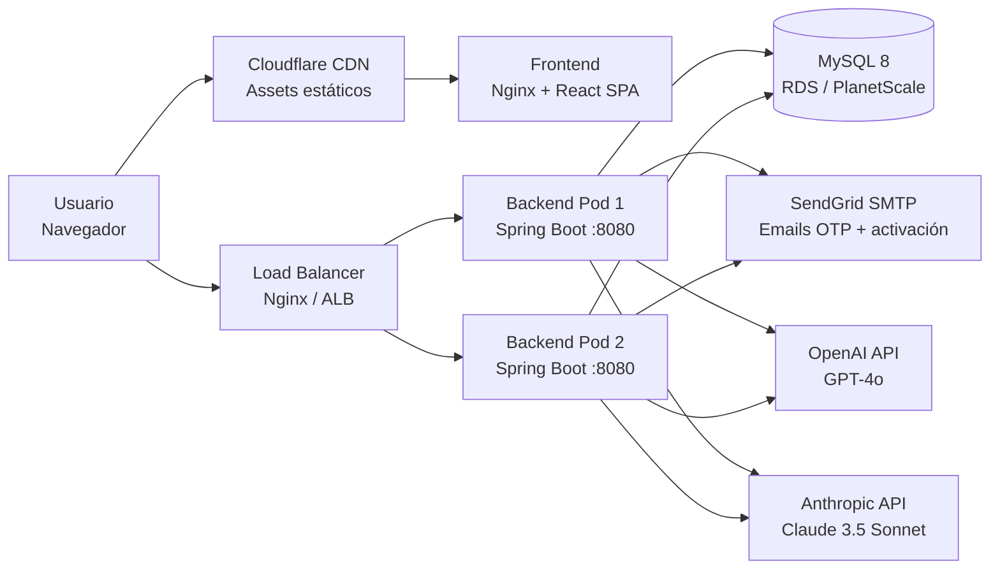

# Arquitectura de Deployment — RenewSim

## Diagrama de Deployment



> Nota: La caché Caffeine es en proceso (JVM), no requiere Redis en la fase actual. Redis se añadirá cuando se escale a más de 2 instancias para compartir contadores de rate limiting.

---

## Dockerfile — Backend

```dockerfile
# Stage 1: Build
FROM eclipse-temurin:21-jdk-alpine AS build
WORKDIR /app

# Copiar descriptor de dependencias primero (aprovecha cache de Docker)
COPY pom.xml .
COPY .mvn .mvn
COPY mvnw .
RUN chmod +x mvnw
RUN ./mvnw dependency:go-offline -q

# Copiar código fuente y compilar
COPY src ./src
RUN ./mvnw clean package -DskipTests -q

# Stage 2: Runtime (imagen mínima)
FROM eclipse-temurin:21-jre-alpine
WORKDIR /app

# Usuario no-root por seguridad
RUN addgroup -S renewsim && adduser -S renewsim -G renewsim
USER renewsim

COPY --from=build /app/target/*.jar app.jar

EXPOSE 8080

# Health check integrado
HEALTHCHECK --interval=30s --timeout=5s --start-period=60s --retries=3 \
    CMD wget --no-verbose --tries=1 --spider \
        http://localhost:8080/actuator/health || exit 1

ENTRYPOINT ["java", \
    "-XX:+UseContainerSupport", \
    "-XX:MaxRAMPercentage=75.0", \
    "-Djava.security.egd=file:/dev/./urandom", \
    "-jar", "app.jar"]
```

---

## Dockerfile — Frontend

```dockerfile
# Stage 1: Build
FROM node:20-alpine AS build
WORKDIR /app

# Copiar package files primero (aprovecha cache de Docker)
COPY package*.json ./
RUN npm ci --silent

# Copiar código fuente y compilar
COPY . .
RUN npm run build

# Stage 2: Serve con Nginx
FROM nginx:1.25-alpine
WORKDIR /usr/share/nginx/html

# Eliminar configuración por defecto
RUN rm -rf ./*

# Copiar build de React
COPY --from=build /app/dist .

# Configuración Nginx para SPA (React Router)
COPY nginx.conf /etc/nginx/nginx.conf

EXPOSE 80

HEALTHCHECK --interval=30s --timeout=3s \
    CMD wget --no-verbose --tries=1 --spider http://localhost:80 || exit 1

CMD ["nginx", "-g", "daemon off;"]
```

### nginx.conf

```nginx
events {
    worker_connections 1024;
}

http {
    include       /etc/nginx/mime.types;
    default_type  application/octet-stream;

    # Compresión gzip
    gzip on;
    gzip_types text/plain text/css application/json application/javascript
               text/xml application/xml application/xml+rss text/javascript;

    server {
        listen 80;
        server_name _;
        root /usr/share/nginx/html;
        index index.html;

        # Headers de seguridad
        add_header X-Frame-Options "DENY" always;
        add_header X-Content-Type-Options "nosniff" always;
        add_header Referrer-Policy "strict-origin-when-cross-origin" always;

        # Cache de assets estáticos (JS, CSS, imágenes)
        location ~* \.(js|css|png|jpg|jpeg|gif|ico|svg|woff2)$ {
            expires 1y;
            add_header Cache-Control "public, immutable";
        }

        # SPA fallback — todas las rutas sirven index.html
        location / {
            try_files $uri $uri/ /index.html;
        }

        # Proxy al backend (evita CORS en desarrollo)
        location /api/ {
            proxy_pass http://backend:8080;
            proxy_set_header Host $host;
            proxy_set_header X-Real-IP $remote_addr;
            proxy_set_header X-Forwarded-For $proxy_add_x_forwarded_for;
        }
    }
}
```

---

## docker-compose.yml

```yaml
version: '3.8'

services:
  backend:
    build:
      context: .
      dockerfile: Dockerfile
    container_name: renewsim-backend
    ports:
      - "8080:8080"
    environment:
      - SPRING_PROFILES_ACTIVE=docker
      - SPRING_DATASOURCE_URL=jdbc:mysql://db:3306/renewsim?useSSL=false&allowPublicKeyRetrieval=true
      - SPRING_DATASOURCE_USERNAME=${DB_USER}
      - SPRING_DATASOURCE_PASSWORD=${DB_PASSWORD}
      - JWT_SECRET=${JWT_SECRET}
      - JWT_EXPIRATION_MS=3600000
      - JWT_REFRESH_EXPIRATION_MS=604800000
      - OPENAI_API_KEY=${OPENAI_API_KEY}
      - ANTHROPIC_API_KEY=${ANTHROPIC_API_KEY}
      - AI_PROVIDER=openai
      - MAIL_HOST=smtp.sendgrid.net
      - MAIL_PORT=587
      - MAIL_USERNAME=apikey
      - MAIL_PASSWORD=${SENDGRID_API_KEY}
      - MAIL_FROM=noreply@renewsim.com
    depends_on:
      db:
        condition: service_healthy
    networks:
      - renewsim-network
    restart: unless-stopped

  db:
    image: mysql:8.0
    container_name: renewsim-db
    environment:
      - MYSQL_ROOT_PASSWORD=${DB_ROOT_PASSWORD}
      - MYSQL_DATABASE=renewsim
      - MYSQL_USER=${DB_USER}
      - MYSQL_PASSWORD=${DB_PASSWORD}
    volumes:
      - mysql-data:/var/lib/mysql
    ports:
      - "3306:3306"
    healthcheck:
      test: ["CMD", "mysqladmin", "ping", "-h", "localhost", "-u", "root", "-p${DB_ROOT_PASSWORD}"]
      interval: 10s
      timeout: 5s
      retries: 5
      start_period: 30s
    networks:
      - renewsim-network
    restart: unless-stopped

  frontend:
    build:
      context: ./frontend
      dockerfile: Dockerfile
    container_name: renewsim-frontend
    ports:
      - "80:80"
    depends_on:
      - backend
    networks:
      - renewsim-network
    restart: unless-stopped

volumes:
  mysql-data:
    driver: local

networks:
  renewsim-network:
    driver: bridge
```

---

## GitHub Actions — CI/CD Pipeline

```yaml
name: RenewSim CI/CD Pipeline

on:
  push:
    branches: [main, develop]
  pull_request:
    branches: [main]

env:
  JAVA_VERSION: '21'
  NODE_VERSION: '20'

jobs:
  # ─────────────────────────────────────────
  # JOB 1: Tests del Backend
  # ─────────────────────────────────────────
  backend-tests:
    name: Backend Tests & Coverage
    runs-on: ubuntu-latest

    services:
      mysql:
        image: mysql:8.0
        env:
          MYSQL_ROOT_PASSWORD: test
          MYSQL_DATABASE: renewsim_test
          MYSQL_USER: test
          MYSQL_PASSWORD: test
        ports:
          - 3306:3306
        options: >-
          --health-cmd="mysqladmin ping"
          --health-interval=10s
          --health-timeout=5s
          --health-retries=5

    steps:
      - uses: actions/checkout@v4

      - name: Set up Java ${{ env.JAVA_VERSION }}
        uses: actions/setup-java@v4
        with:
          java-version: ${{ env.JAVA_VERSION }}
          distribution: 'temurin'
          cache: 'maven'

      - name: Run unit and integration tests
        run: ./mvnw clean test
        env:
          SPRING_DATASOURCE_URL: jdbc:mysql://localhost:3306/renewsim_test
          SPRING_DATASOURCE_USERNAME: test
          SPRING_DATASOURCE_PASSWORD: test
          JWT_SECRET: test-secret-at-least-32-characters-long

      - name: Generate JaCoCo coverage report
        run: ./mvnw jacoco:report

      - name: Enforce coverage threshold (≥70%)
        run: ./mvnw jacoco:check

      - name: Upload coverage to Codecov
        uses: codecov/codecov-action@v4
        with:
          file: ./target/site/jacoco/jacoco.xml
          flags: backend

  # ─────────────────────────────────────────
  # JOB 2: Tests del Frontend
  # ─────────────────────────────────────────
  frontend-tests:
    name: Frontend Tests & Build
    runs-on: ubuntu-latest

    steps:
      - uses: actions/checkout@v4

      - name: Set up Node.js ${{ env.NODE_VERSION }}
        uses: actions/setup-node@v4
        with:
          node-version: ${{ env.NODE_VERSION }}
          cache: 'npm'
          cache-dependency-path: frontend/package-lock.json

      - name: Install dependencies
        run: npm ci
        working-directory: frontend

      - name: Run tests
        run: npm run test -- --run
        working-directory: frontend

      - name: Build production bundle
        run: npm run build
        working-directory: frontend
        env:
          VITE_API_BASE_URL: https://api.renewsim.com/api/v1

      - name: Upload coverage to Codecov
        uses: codecov/codecov-action@v4
        with:
          file: ./frontend/coverage/lcov.info
          flags: frontend

  # ─────────────────────────────────────────
  # JOB 3: Build Docker Images
  # ─────────────────────────────────────────
  build-images:
    name: Build & Push Docker Images
    runs-on: ubuntu-latest
    needs: [backend-tests, frontend-tests]
    if: github.ref == 'refs/heads/main'

    steps:
      - uses: actions/checkout@v4

      - name: Log in to Docker Hub
        uses: docker/login-action@v3
        with:
          username: ${{ secrets.DOCKER_USERNAME }}
          password: ${{ secrets.DOCKER_PASSWORD }}

      - name: Build and push backend image
        uses: docker/build-push-action@v5
        with:
          context: .
          file: ./Dockerfile
          push: true
          tags: |
            renewsim/backend:latest
            renewsim/backend:${{ github.sha }}

      - name: Build and push frontend image
        uses: docker/build-push-action@v5
        with:
          context: ./frontend
          file: ./frontend/Dockerfile
          push: true
          tags: |
            renewsim/frontend:latest
            renewsim/frontend:${{ github.sha }}

  # ─────────────────────────────────────────
  # JOB 4: Deploy a Producción
  # ─────────────────────────────────────────
  deploy:
    name: Deploy to Production
    runs-on: ubuntu-latest
    needs: [build-images]
    if: github.ref == 'refs/heads/main'
    environment: production

    steps:
      - uses: actions/checkout@v4

      - name: Deploy via SSH
        uses: appleboy/ssh-action@v1
        with:
          host: ${{ secrets.PROD_HOST }}
          username: ${{ secrets.PROD_USER }}
          key: ${{ secrets.PROD_SSH_KEY }}
          script: |
            cd /opt/renewsim
            docker compose pull
            docker compose up -d --no-build
            docker compose ps
            echo "Deployment completed at $(date)"
```

---

## Variables de Entorno

### Backend (`.env` — nunca commitear)

```bash
# Base de datos
SPRING_DATASOURCE_URL=jdbc:mysql://localhost:3306/renewsim
SPRING_DATASOURCE_USERNAME=renewsim_user
SPRING_DATASOURCE_PASSWORD=<contraseña-segura>

# JWT (mínimo 32 caracteres, generado con: openssl rand -hex 32)
JWT_SECRET=<secreto-aleatorio-minimo-32-chars>
JWT_EXPIRATION_MS=3600000          # 1 hora
JWT_REFRESH_EXPIRATION_MS=604800000 # 7 días

# Proveedores LLM
OPENAI_API_KEY=sk-...
ANTHROPIC_API_KEY=sk-ant-...
AI_PROVIDER=openai
AI_FALLBACK_PROVIDER=anthropic

# Email (SendGrid)
MAIL_HOST=smtp.sendgrid.net
MAIL_PORT=587
MAIL_USERNAME=apikey
MAIL_PASSWORD=<sendgrid-api-key>
MAIL_FROM=noreply@renewsim.com

# Spring profiles
SPRING_PROFILES_ACTIVE=prod
```

### Frontend (`.env.production`)

```bash
VITE_API_BASE_URL=https://api.renewsim.com/api/v1
VITE_ENABLE_DEBUG=false
VITE_APP_VERSION=$npm_package_version
```

---

## Estrategia de Entornos

| Entorno | Backend URL | Frontend URL | BD | Notas |
|---------|-------------|--------------|-----|-------|
| Local | localhost:8080 | localhost:5173 | MySQL local | `SPRING_PROFILES_ACTIVE=local` |
| Docker | backend:8080 | localhost:80 | MySQL container | `docker compose up` |
| Staging | api.staging.renewsim.com | staging.renewsim.com | MySQL RDS (small) | Deploy en PR a main |
| Producción | api.renewsim.com | renewsim.com | MySQL RDS (prod) | Deploy en merge a main |
